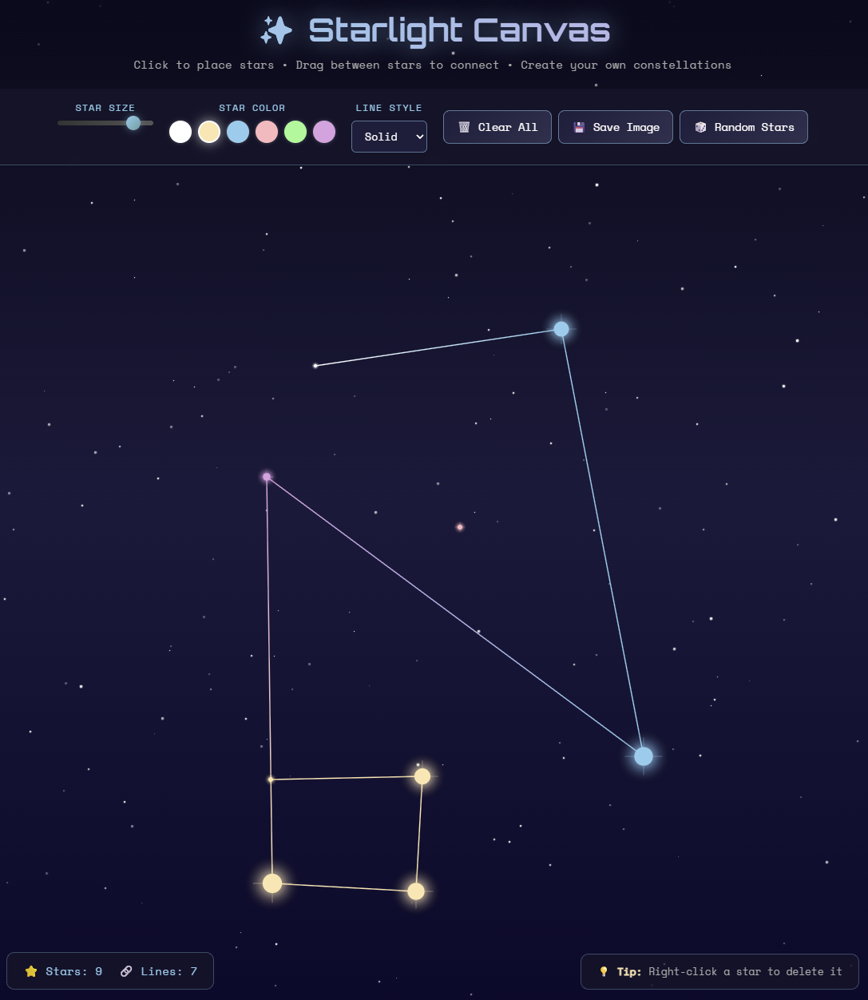

### A Note from the Human
Hey, Matt here. Just a quick note about what this is and why it exists. I was bored one afternoon, so I asked an AI agent to build whatever web application they wanted. I used Claude Opus 4.5 through Github Copilot inside of VS Code. Here was my prompt:

> Build a web app! It needs to be able to be published using Github Pages eventually. Ideally, the user should find the app fun or useful or enjoyable. Otherwise, feel free to be creative and do whatever your heart pleases! Try to get it functioning in 1 shot, and use tools and mcp servers to start the dev server and look at it during the process, to make sure it looks and acts how you intend. If you need me to test anything along the way, let me know with questions.

The agent proceeded to build this ["Starlight Canvas"](https://matt-nolan11.github.io/starlight-canvas) web application. It's fairly amusing, and everything worked on the first try, which impressed me greatly. The whole process, including creating the git repo and pushing to GitHub (and prompting me to install Github CLI along the way), took less than 10min. All I had to do was add the "preview.png" image and tell Github to use the main branch as the GitHub Pages source. AI coding tools are continuing to get more sophisticated and seamless. If nothing else, this served as an interesting exercise.

The rest of this ReadMe was written by Claude:

# ✨ Starlight Canvas

An interactive constellation creator where you paint the night sky with stars and connect them into your own constellations. Built for the web, deployable on GitHub Pages.



## 🌟 Features

- **Click to create stars** - Place twinkling stars anywhere on the canvas
- **Drag to connect** - Draw lines between stars to form constellations
- **Right-click to delete** - Remove stars you don't want
- **Customizable stars** - Adjust size and choose from 6 beautiful colors
- **Line styles** - Solid, dashed, or dotted constellation lines
- **Random generation** - Instant star field with auto-connected constellations
- **Save your art** - Download your creation as a PNG image
- **Ambient atmosphere** - Animated background stars and shooting stars

## 🎮 How to Use

1. **Add stars**: Click anywhere on the dark sky to place a star
2. **Connect stars**: Click and drag from one star to another to draw a line
3. **Customize**: Use the toolbar to change star size, color, and line style
4. **Delete**: Right-click any star to remove it and its connections
5. **Save**: Click "Save Image" to download your constellation art

## 🚀 Live Demo

Visit: [starlight-canvas GitHub Pages URL]

## 💻 Local Development

Simply open `index.html` in a browser, or run a local server:

```bash
python -m http.server 8080
```

Then visit `http://localhost:8080`

## 📖 How This App Came About

This project was created as a creative, relaxing web experience that anyone can enjoy. The goal was to build something:

1. **Fun and engaging** - Creating constellations is inherently satisfying
2. **Visually beautiful** - The night sky aesthetic with twinkling animations creates an immersive atmosphere
3. **Zero dependencies** - Pure HTML, CSS, and JavaScript for instant loading and GitHub Pages compatibility
4. **Accessible** - Works on desktop (mouse) and mobile (touch)

## 🎨 Design Decisions

### Why a Constellation Creator?

Stars and space have universal appeal. The activity of creating constellations is:
- **Creative** - Users express themselves through their star arrangements
- **Relaxing** - The dark theme, gentle animations, and ambient shooting stars create a calming experience
- **Shareable** - The save feature lets users keep and share their creations

### Technical Choices

**Pure Vanilla JS/CSS/HTML**
- No build step required
- Instant deployment to GitHub Pages (just push and enable Pages)
- Fast load times with no framework overhead
- Easy to understand and modify

**Canvas API for Stars**
- Hardware-accelerated rendering for smooth animations
- Efficient for hundreds of animated objects
- Enables complex visual effects (glows, gradients, particle bursts)

**CSS for Background Effects**
- Decorative background stars use CSS for simplicity
- Shooting stars are CSS animations (GPU-accelerated)
- Separation of concerns: Canvas handles interactive elements, CSS handles ambiance

**Gradient Color Blending**
- Lines inherit colors from connected stars with smooth gradients
- Creates visual harmony without requiring manual color selection for lines

**Radial Glow Effects**
- Stars have a soft glow using radial gradients
- Mimics real star appearance with atmospheric diffusion
- The 4-pointed sparkle adds that classic "star" look

### UX Decisions

**Minimal UI**
- Controls are present but unobtrusive
- Dark, translucent toolbar blends with the aesthetic
- Stats provide feedback without distraction

**Immediate Feedback**
- Particle burst when placing stars
- Visual drag preview when connecting
- Real-time twinkle animation

**Forgiving Interaction**
- Large hit areas for star selection (10px buffer)
- Right-click delete is intuitive
- Touch support for mobile users

## 📁 Project Structure

```
starlight-canvas/
├── index.html    # Main HTML structure
├── style.css     # All styling and animations
├── script.js     # StarlightCanvas class with all logic
└── README.md     # This file
```

## 🌐 Deploying to GitHub Pages

1. Push this repository to GitHub
2. Go to Settings → Pages
3. Set Source to "Deploy from a branch"
4. Select `main` branch and `/ (root)` folder
5. Save and wait ~1 minute for deployment

Your constellation creator will be live at `https://[username].github.io/starlight-canvas/`

## 📄 License

MIT License - Feel free to use, modify, and share!

---

*Created with ❤️ and a love for the night sky*
